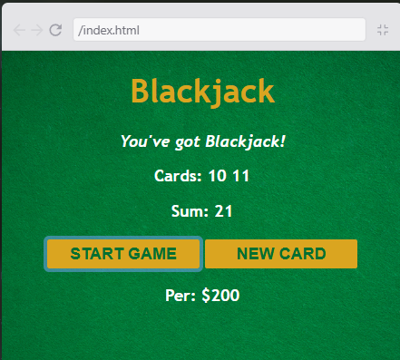

BLACKJACK GAME

Descripcion
Se realizo un juego de blackjack, tiene funciones como startGame(), getRamdomCart(), newCart() y renderGame(), que permiten poder usar un juego basico de blackjack.

Recursos vistos
-Objetos
-arrays
-boleanos
-sentencias if/else
-comparadores
-operadores de logica
-loops
-el objeto Math

