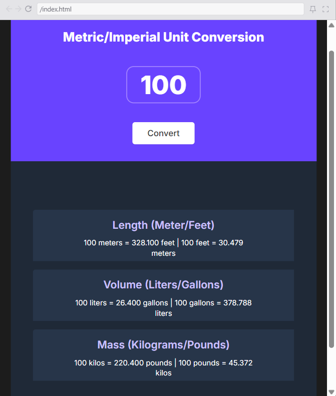

CONVERSOR DE UNIDADES

Descripcion
Se realizo un conversor de unidades que permite ingresar un numero y saber su equivalencia a metros a pies/pies a metros, galones a litros/litros a galones y kilos a libras/libras a kilos, solo mostrando los primeros 3 decimales de la conversion.

Recursos vistos

- ().toFixed
- addListener
- Template Literals

