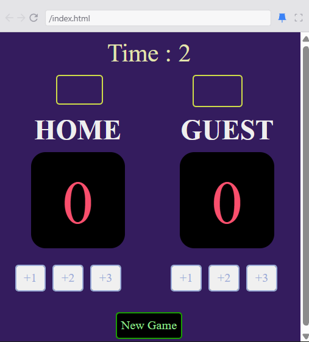

MARCADOR PARA JUEGO DE BASQUETBALL

Descripcion
Se hizo la logica y diseño de un marcador que registro el tiempo, la puntuacion, un indicador de que equipo va ganando y un boton para resetear a un nuevo juego.

Se uso figma para cambiar el diseño, solo se enfoco en la logica de JS.

Recursos vistos
-timeSet()
-condicionales, variables y funciones.
-Refuerzo de mi logica
-Manipulacion del DOM

