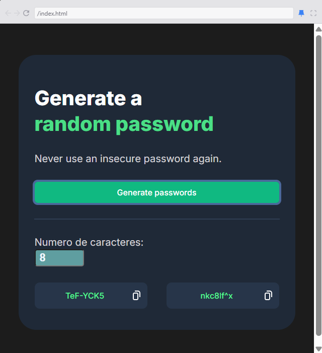

GENERADOR DE CONTRASEŇAS

Descripcion
Se realizo de cero una pagina con css, html, y logica en javascript, para generar contraseñas con un minimo de 4 caracteres y un maximo de 15, dependiendo del numero de caracteres deseado.

Se uso figma para desarrollar el diseño que se recomendo en el curso, pero, se ajusto para que fuera responsivo.

Recursos vistos
-Math.random()
-loops, arrays y condicionales trabajando en conjunto
-Refuerzo lo anterior visto

