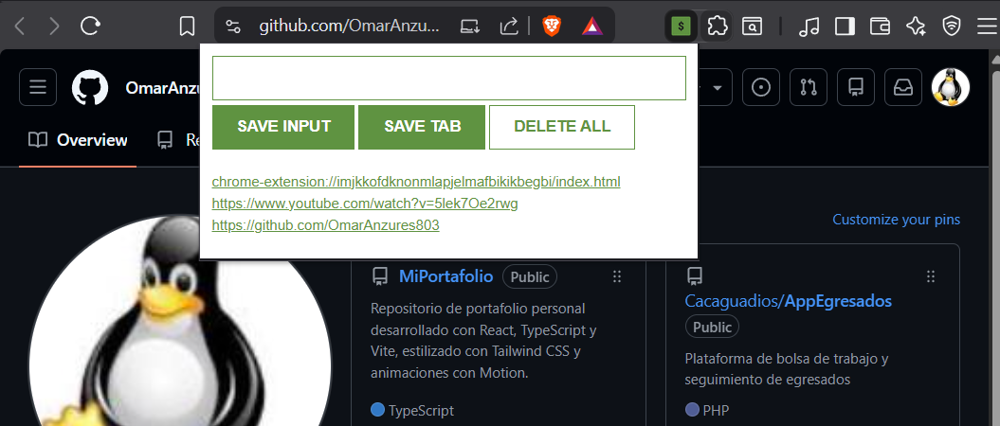

EXTENSION PARA CHROME

Descripcion
Se realizo una extension para navegador que administra direcciones web, permite agrega la direccion actual, agregar otras direcciones desde el input que contiene y eliminar direcciones

Se creo todo el codigo html, css y logica js, desde cero.

Recursos vistos
-const
-addEventListener()
-innerHTML
-input.value
-Parametros en funciones
-template strings
-localStorage
-JSON object
-objetos en arrays

