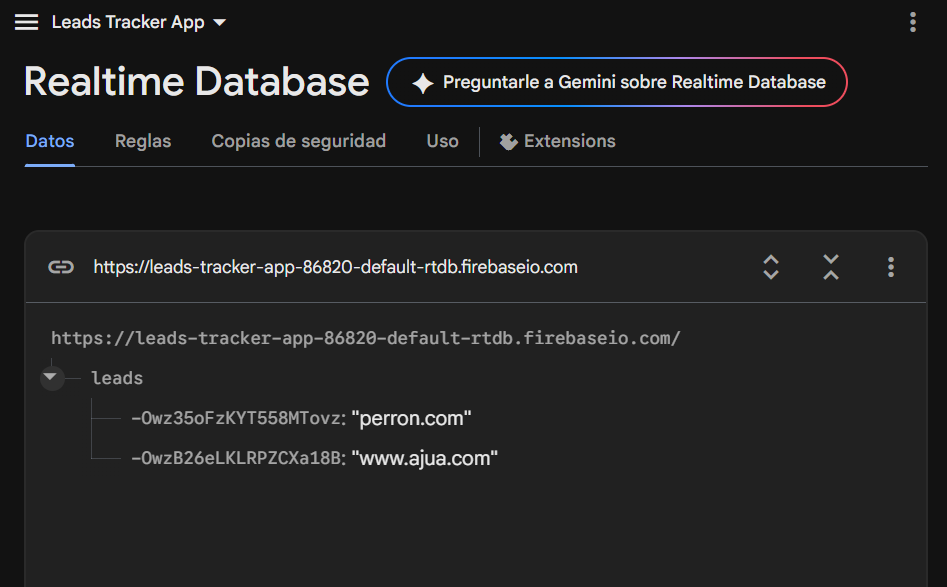
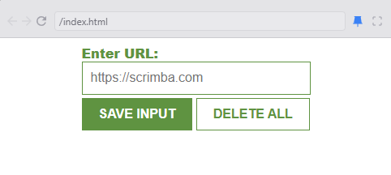

EXTENSION PARA CHROME (DESPLIEGUE)

Descripcion
Del anterior proyecto que fue una extension para navegadores, usando el mismo codigo fuente, ahora se hicieron ajustes para no solamente manejar datos locales, si no tambien para obtener datos desde una base de datos en firebase, importando el objeto initializeApp que contiene la configuracion inicial de un proyecto en firebase, de alli creando un objeto que contiene nuestra url a la base de datos en firebase, ademas de usar mas funciones importadas push, onValue, ref, etc. para manejar el array de las direcciones almacenadas.

Recursos vistos

-Firebase: snapshot
-Firebase: snapshot.exist()
-Object -> Array
-Firebase:remove

