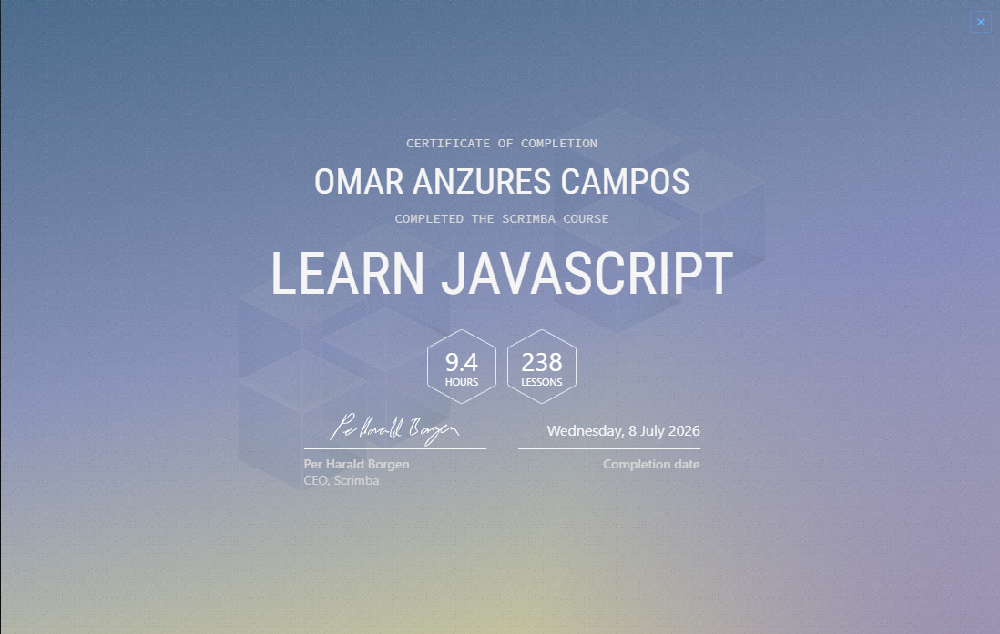
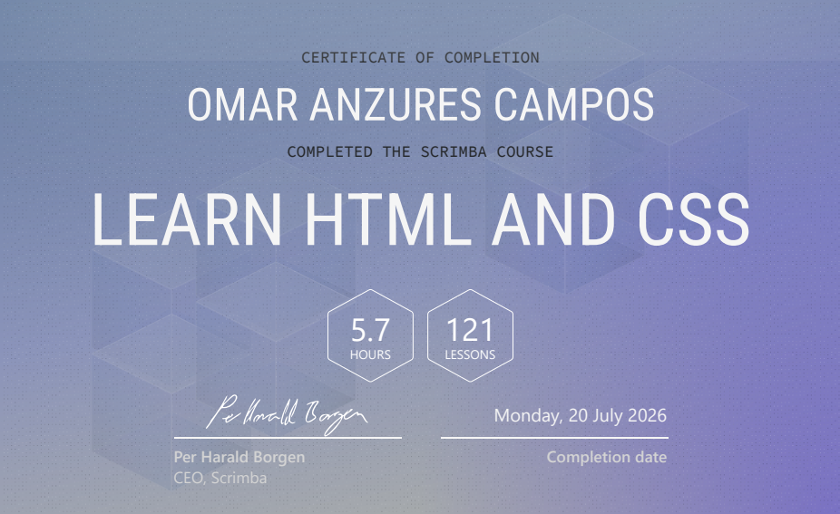

MI CAMINO COMO DESARROLLADOR

Este repositorio como habia mencionado en la descripcion de este es unicamente para hacer registro de todo lo que hago en scrimba, ejercicios, proyectos y recursos.

CONTENIDO

**01-javascript** - Fundamentos de JavaScript, variables, id, DOM, y proyectos interactivos.
**02-html-and-css** - Etiquetas basicas, estructura html, sintaxis css basica, css flexbox basico, margenes, padding, bordes y despliegue en vercel.
**03-css-challenges**-

